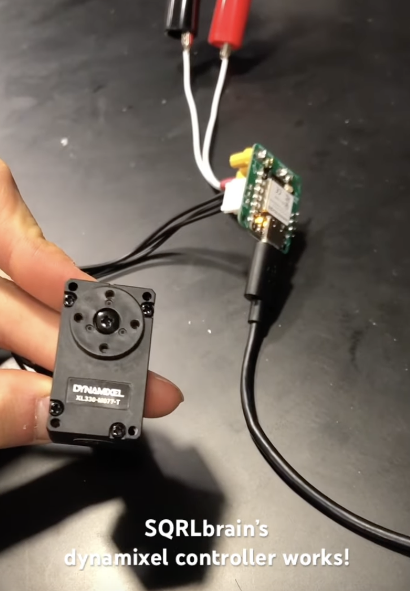
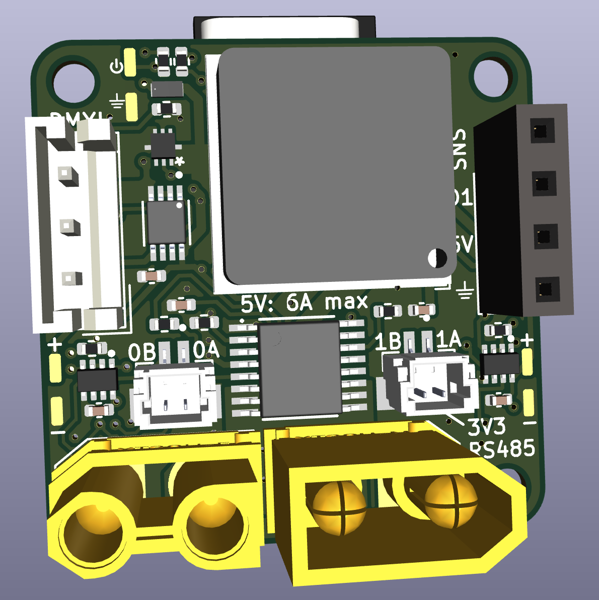
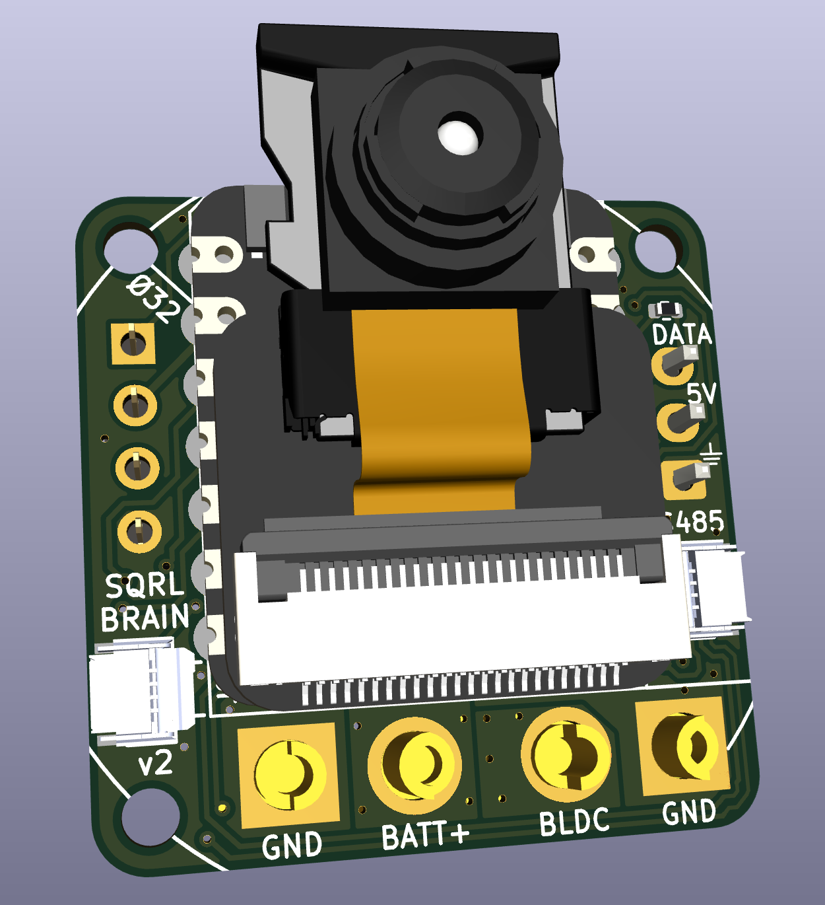
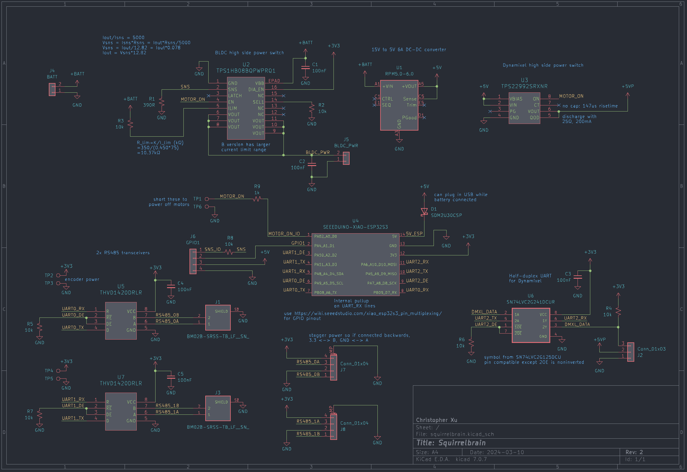

## Squirrelbrain v2

[Youtube video](https://youtube.com/shorts/pgTb6q6fkRE?feature=shared)

Main control board for the [Pintobotics](https://pintobotics.substack.com) robotic squirrel. It uses a Seeeduino XIAO ESP32S3 for wireless communication with a base station, is able to drive [dynamixel 5V TTL servos](https://www.robotis.us/dynamixel-xl330-m077-t/) up to 6A, and has two separate RS485 buses. 

The RS485 buses are intended for:
* [Ø32controller](https://github.com/qwertpas/O32controller), a miniature closed-loop brushless motor driver
* [Ø12encoder](https://github.com/qwertpas/O12encoder), a miniature magnetic encoder (MA702)
* [Ø12imu](https://github.com/qwertpas/O12imu), a miniature IMU with built-in sensor fusion for orientation (LSM6DSV) 

Squirrelbrain has two load switches to allow the ESP32 to cut off power to the motors when the battery is still connected. One load switch operates an XT30 output, featuring current sensing and a programmed current limit of 38A (limit can be adjusted by replacing a resistor). The other load switch operates on the 5V supply intended for dynamixel servos.

Size: 27mm x 27mm

Mounting: 4x M2 on 32mm diameter circle 

Connections:
* 2x JST-SH 2pin connectors for RS485 communication (1 for each bus)
* 2x 4pin 0.5mm pitch double-sided FFC connectors for RS485 communication (1 for each bus)
* 2x solder pads for 3.3V output
* JST-EH 3pin connector for dynamixel TTL
* USB-C on the ESP32S3
* Optional camera module on the ESP32S3
* XT30U-M power in (5-15V)
* XT30U-F power out
* 4pin header for current sense output, extra GPIO, and 5V/GND output

#### Changelog from Squirrelbrain v1:
Squirrelbrain v1 does not have the FFC connectors and is missing a pullup on the dynamixel data line.